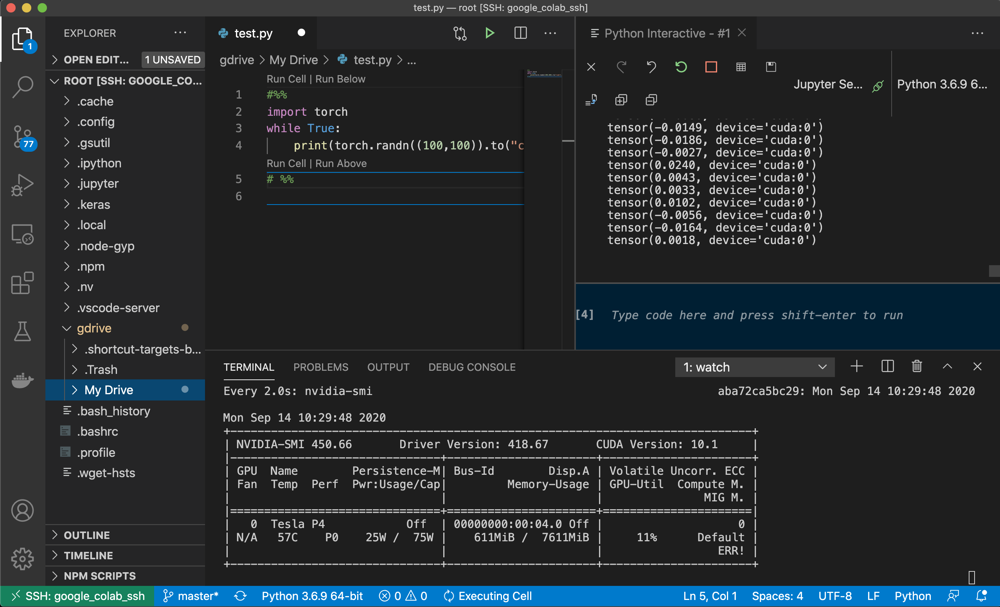
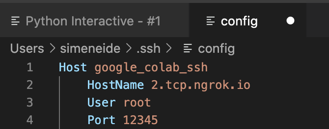

+++
date = 2020-09-14
title = "Running Google Colab with VS code"
active = true
tags = ["foo"]
+++

Running VScode and the python extension is great for development.
I get clean python files *and* can run my code interactively.
It is the same setup we have at work and I then remotely connect to a server with more cpu and GPU.
However, for my side gigs I havent really figured out a workflow, until now.

This morning I found [colab-ssh](https://github.com/WassimBenzarti/colab-ssh). It enables you to **remotely connect your google colab instance to your local VScode**! 
And if you have a GPU runtime on google colab you get that as well, of course. 
Combining this with a small google drive mounting, and I **get more or less my local working environment but with GPU acceleration**.



A quick step-by-step (see [colab-ssh](https://github.com/WassimBenzarti/colab-ssh) for updates if this doesnt work):
1. Open a new google colab notebook.
2. In first cell: Mount your google drive using these commands (you need to follow link and authorize):
```
from google.colab import drive
drive.mount('/root/gdrive')
```
3. Go to [this site](https://dashboard.ngrok.com/auth/your-authtoken) and get an ngrok token.
4. Second cell: Add your token and create a password. Then add+run this:

```
# Install colab_ssh on google colab
!pip install colab_ssh --upgrade
ngrokToken = 'XXX'
password = 'XXX'
from colab_ssh import launch_ssh, init_git
launch_ssh(ngrokToken,password)
```
5. You'll now see something like this:
```
Collecting colab_ssh
  Downloading https://files.pythonhosted.org/packages/a7/c5/eedfd8b374fead9d863cb7031d9dc97fed50003372922ba0efd85d9fe3e0/colab_ssh-0.2.63-py3-none-any.whl
Installing collected packages: colab-ssh
Successfully installed colab-ssh-0.2.63
Successfully running 2.tcp.ngrok.io:13254
[Optional] You can also connect with VSCode SSH Remote extension using this configuration:

	Host google_colab_ssh
		HostName 2.tcp.ngrok.io
		User root
		Port 12345
```

5. Go to your local VScode and select Remote-SSH: Open Configuration File, and paste the config above:




6. Select Remote-SSH: Connect to Host and select the google colab ssh connection.


Voila! Up and running with gpu and your google drive attached. 

Unfortunately, the hostname and port changes each time, and you still have to manually open the google colab.

Still, really great work by Wassim Benzarti.