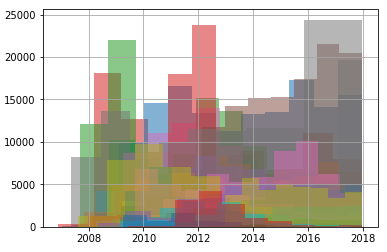

+++
date = 2018-08-19
title = "Tweet classification workshop"
active = true
tags = ["foo"]
+++

I have held an introductory machine learning workshop a couple of times.
The aim is to classify who said what on Twitter among Norwegian celebrities.

Project:
https://github.com/simeneide/tweet-classification

using figure:

